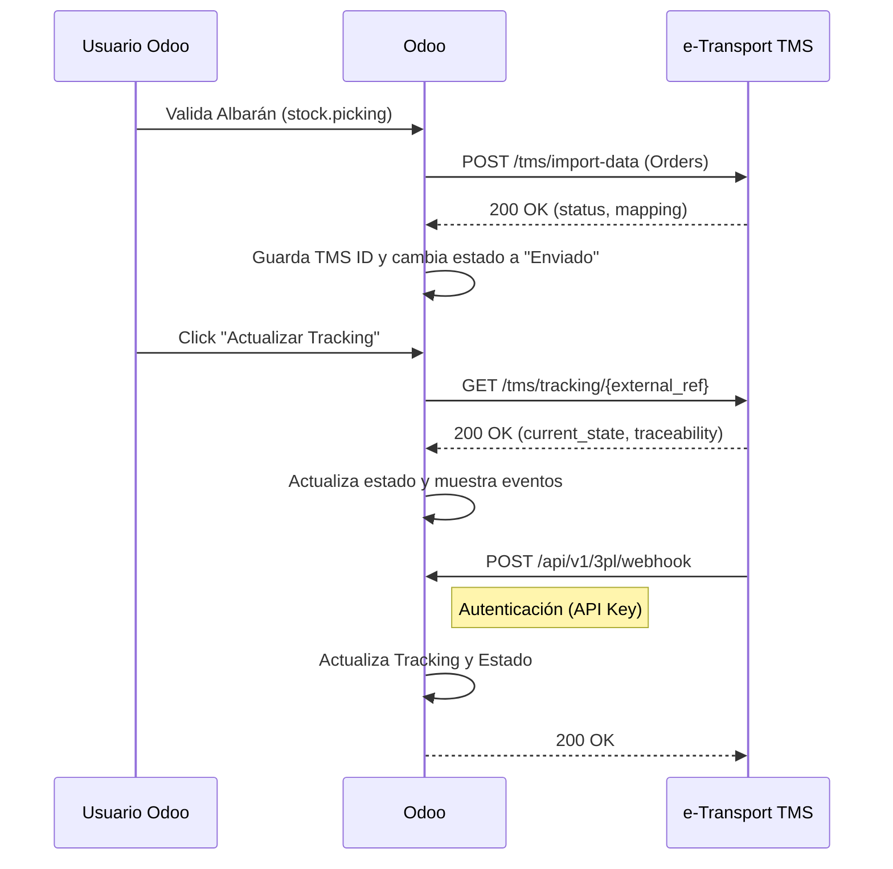

# Especificación de Integración e-Transport TMS para Odoo 19 (Community Edition)

Este documento detalla la arquitectura y diseño técnico para integrar Odoo 19 CE (On-Premise) con e-Transport TMS.

## 1. Arquitectura de la Integración

La integración es bidireccional y consta de dos flujos principales:

1.  **Outbound (Odoo -> e-Transport):** Envío de órdenes de entrega (Albaranes) cuando se validan en Odoo.
2.  **Inbound (e-Transport -> Odoo):** Actualización de estado y tracking mediante fetch manual o Webhooks.

### Diagrama de Flujo



## 2. API de e-Transport

### 2.1 Autenticación

Todas las llamadas a la API requieren el header:
```
X-API-Key: YOUR_PROJECT_TOKEN
```

### 2.2 Endpoint de Importación (Outbound)

**Endpoint:** `POST https://e-transport.es/api/tms/import-data`

**Payload de ejemplo:**
```json
{
  "Orders": [
    {
      "ExternalRef": "WH/OUT/00001",
      "ShipmentType": "E",
      "ServiceType": "ND_3H",
      "Legs": [
        {
          "UnLoadName": "Cliente Ejemplo S.L.",
          "UnLoadAddress": "Carrer Major 123",
          "UnLoadCity": "Barcelona",
          "UnLoadZip": "08015",
          "UnLoadCountry": "ES",
          "UnLoadDate": "2025-03-15",
          "UnLoadStartTime": "08:00",
          "UnLoadEndTime": "11:00",
          "UnLoadTel": "+34612345678",
          "UnLoadEmail": "cliente@example.com",
          "Goods": [
            {
              "Packs": 3,
              "PacksTypeID": "PROD-001",
              "PacksDescription": "Producto Congelado",
              "PacksTemperature": "FR",
              "GrossWeight": 25.0,
              "Cube": 0.3,
              "Parcels": []
            }
          ]
        }
      ]
    }
  ]
}
```

**Campos del Payload:**

| Campo | Tipo | Requerido | Descripción |
|-------|------|-----------|-------------|
| `ExternalRef` | string | ✅ | Referencia única (nombre del albarán) |
| `ShipmentType` | string | ✅ | Tipo de envío (E=Entrega, M=Movimiento) |
| `ServiceType` | string | ✅ | Tipo de servicio (ej: ND_3H) |
| `UnLoadName` | string | ✅ | Nombre del destinatario |
| `UnLoadAddress` | string | ✅ | Dirección de entrega |
| `UnLoadCity` | string | ✅ | Ciudad |
| `UnLoadZip` | string | ✅ | Código postal |
| `UnLoadCountry` | string | ✅ | Código de país (ES, FR, etc.) |
| `UnLoadDate` | string | ❌ | Fecha de entrega (YYYY-MM-DD) |
| `UnLoadStartTime` | string | ❌ | Hora inicio franja (HH:MM) |
| `UnLoadEndTime` | string | ❌ | Hora fin franja (HH:MM) |
| `UnLoadTel` | string | ❌ | Teléfono del destinatario |
| `UnLoadEmail` | string | ❌ | Email del destinatario |
| `Packs` | integer | ❌ | Número de bultos |
| `PacksTypeID` | string | ✅ | Código/identificador del producto |
| `PacksDescription` | string | ❌ | Descripción del producto |
| `PacksTemperature` | string | ✅ | Temperatura (AM, FR, CO) |
| `GrossWeight` | float | ❌ | Peso total en kg |
| `Cube` | float | ❌ | Volumen en m³ |

**Respuesta esperada:**
```json
{
  "status": "success",
  "orders_created": 1,
  "orders_updated": 0,
  "warnings": [],
  "errors": [],
  "mapping": {
    "orders": {
      "WH/OUT/00001": 4589
    }
  }
}
```

### 2.3 Endpoint de Tracking

**Endpoint:** `GET https://e-transport.es/api/tms/tracking/{external_ref}`

**Parámetros de query:**
- `include_traceability` (default: true)
- `include_packs` (default: true)
- `traceability_limit` (default: 50)

**Respuesta esperada:**
```json
{
  "external_ref": "WH/OUT/00001",
  "current_state": "en_ruta",
  "date": "2025-03-15",
  "time_range": "08:00 - 11:00",
  "eta": "2025-03-15T09:30:00",
  "traceability": [
    {
      "timestamp": "2025-03-15T08:15:00",
      "state": "salida_almacen",
      "event": "Vehículo salió del almacén",
      "location": "Barcelona Hub"
    }
  ],
  "parcels": []
}
```

## 3. Configuración en Odoo

### 3.1 Parámetros de Configuración

Accesible en: **Ajustes > Inventario > e-Transport 3PL Integration**

| Parámetro | Descripción | Valor por defecto |
|-----------|-------------|-------------------|
| **Conexión API** | | |
| API URL | URL base de e-Transport | `https://e-transport.es/api` |
| API Key | Token X-API-Key | - |
| 3PL Warehouse | Almacén para filtrar albaranes | - (todos) |
| **Parámetros e-Transport** | | |
| ShipmentType (eCommerce) | Código para pedidos web | `E` |
| ShipmentType (Internal) | Código para pedidos internos | `M` |
| ServiceType | Código de servicio | `ND_3H` |
| Default Temperature | Temperatura por defecto | `FR` (Frío) |
| **Automatización** | | |
| Auto Send | Envío automático al validar | `False` |
| Web Orders Only | Solo pedidos eCommerce (sub-opción de Auto Send) | `False` |
| Allow Resend to 3PL | Permite reenviar pedidos ya enviados | `False` |
| **Tracking** | | |
| Tracking URL Base | URL base para construir enlaces de seguimiento | `https://e-transport.es/tracking/` |
| Webhook User | Usuario para operaciones automáticas desde webhook | OdooBot (fallback) |

### 3.2 Temperaturas Disponibles

| Código | Descripción |
|--------|-------------|
| `AM` | Ambiente |
| `FR` | Frío (refrigerado) |
| `CO` | Congelado |

## 4. Flujo de Trabajo en Odoo

### 4.1 Estados del Albarán

#### Estados nativos de Odoo + estado intermedio 3PL

| Estado (`state`) | Descripción |
|------------------|-------------|
| `draft` | Borrador |
| `confirmed` | Confirmado |
| `assigned` | Listo (reservado) |
| `waiting_3pl` | **Esperando confirmación del 3PL** (nuevo) |
| `done` | Hecho |
| `cancel` | Cancelado |

#### Estados 3PL (`x_3pl_status`)

| Estado | Descripción | Badge Color |
|--------|-------------|-------------|
| `draft` | No enviado | ⚪ Gris |
| `sent` | Enviado a e-Transport | 🔵 Azul |
| `shipped` | En tránsito | 🟠 Naranja |
| `delivered` | Entregado | 🟢 Verde |
| `error` | Error en envío | 🔴 Rojo |

### 4.2 Campos Adicionales

| Campo | Descripción |
|-------|-------------|
| `x_3pl_order_id` | ID del pedido en e-Transport (TMS ID) |
| `x_3pl_tracking_ref` | Número de tracking |
| `x_3pl_tracking_url` | URL de seguimiento |
| `x_3pl_current_state` | Estado actual reportado por e-Transport |
| `x_3pl_eligible` | (Computed) Si el albarán es elegible para 3PL |
| `x_3pl_can_resend` | (Computed) Si se puede reenviar |
| `x_is_web_order` | (Computed) Si viene de un pedido eCommerce |

### 4.3 Botones Disponibles

| Botón | Visible cuando | Acción |
|-------|----------------|--------|
| **Enviar a e-Transport** | Estado `assigned`, status `draft` o `error`, elegible | Envía el albarán a e-Transport |
| **Reenviar a e-Transport** (retry) | Status `error`, estado ≠ `assigned` | Reintenta el envío tras error |
| **Reenviar a e-Transport** (resend) | `x_3pl_can_resend` = True (requiere `allow_resend`) | Reenvía pedido ya enviado |
| **Actualizar Tracking** | Status `sent` o `shipped` | Consulta el tracking vía API |
| **Validar (Forzar)** | Estado `waiting_3pl` | Valida sin esperar confirmación 3PL |
| **Ver Tracking** | Existe `x_3pl_tracking_url` | Abre la URL de tracking en nueva pestaña |

## 5. Mapeo de Campos Odoo → e-Transport

| Campo Odoo | Campo e-Transport |
|------------|-------------------|
| `picking.name` | `ExternalRef` |
| `picking.x_is_web_order` | Determina `ShipmentType` |
| `partner.name` | `UnLoadName` |
| `partner.street` | `UnLoadAddress` |
| `partner.city` | `UnLoadCity` |
| `partner.zip` | `UnLoadZip` |
| `partner.country_id.code` | `UnLoadCountry` |
| `partner.phone / mobile` | `UnLoadTel` |
| `partner.email` | `UnLoadEmail` |
| `picking.scheduled_delivery_date` | `UnLoadDate` |
| `delivery_time_slot.start_hour` | `UnLoadStartTime` |
| `delivery_time_slot.end_hour` | `UnLoadEndTime` |
| `move.product_uom_qty` | `Packs` |
| `product.default_code` | `PacksTypeID` |
| `product.name` | `PacksDescription` |
| Configuración global | `PacksTemperature` |
| `product.weight * qty` | `GrossWeight` |
| `product.volume * qty` | `Cube` |

## 6. Infraestructura y Red

### 6.1 Configuración de Gateway / Ingress (para Webhooks)

Si e-Transport puede enviar webhooks, exponer el endpoint:

Archivo: `argocd/apps/odoo/odoo/templates/httproute.yaml`

```yaml
rules:
  - matches:
      - path:
          type: PathPrefix
          value: /api/v1/3pl
    backendRefs:
      - name: odoo-service
        port: 8069
```

### 6.2 Webhook Endpoint (Opcional)

**Endpoint:** `POST /api/v1/3pl/webhook`

**Headers requeridos:**
```
Authorization: Bearer <API_KEY>
Content-Type: application/json
```

**Payload esperado:**
```json
{
  "order_id": "WH/OUT/0001",
  "tracking_number": "ET-123456",
  "tracking_url": "https://e-transport.es/tracking/ET-123456",
  "status": "shipped"
}
```

## 7. Troubleshooting

### Error: "3PL API configuration is missing"
→ Verificar que API URL y API Key están configurados en Ajustes > Inventario.

### Error: "401 Unauthorized"
→ El token X-API-Key es inválido o ha expirado. Contactar con e-Transport.

### Error: "ShipmentType 'X' not found"
→ Verificar que el ShipmentType configurado existe en e-Transport.

### Error: "Customer 'X' does not exist"
→ e-Transport no reconoce el cliente. Puede requerir configuración previa.

### El tracking no se actualiza
→ Usar el botón "Actualizar Tracking" para forzar una consulta manual.
