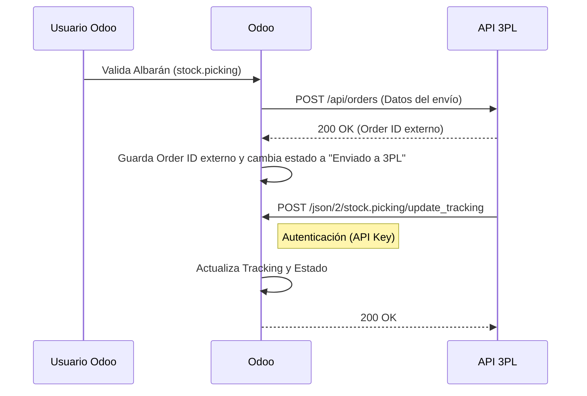

# Especificación de Integración 3PL para Odoo 19 (Community Edition)

Este documento detalla la arquitectura y diseño técnico para integrar Odoo 19 CE (On-Premise) con un operador logístico (3PL) utilizando una API genérica.

## 1. Arquitectura de la Integración

La integración es bidireccional y consta de dos flujos principales:

1.  **Outbound (Odoo -> 3PL):** Envío de órdenes de entrega (Albaranes) cuando se validan en Odoo.
2.  **Inbound (3PL -> Odoo):** Actualización de estado, tracking number y confirmación de stock mediante Webhooks.

### Diagrama de Flujo



## 2. Especificidades de Odoo 19

En Odoo 19, se recomienda preparar la transición hacia la nueva API JSON-2, aunque en versiones On-Premise CE los controladores tradicionales RPC siguen activos.

### API de Salida (Outbound)
Para las llamadas hacia el 3PL, se utilizará la librería estándar `requests` de Python.
- **Librería:** `requests` (incluida en el entorno estándar de Odoo).
- **Endpoint:** `POST {API_URL}/orders`
- **Headers:** `Content-Type: application/json`, `Authorization: Bearer {API_KEY}`
- **Payload:** Ver sección 3.1 para el formato completo.
- **Respuesta Esperada:** El 3PL debe responder con código 200 o 201 y un JSON con el campo `order_id` (ID externo del pedido en el sistema 3PL):
  ```json
  {
    "order_id": "EXT-12345"
  }
  ```
- **Manejo de Errores:** Los errores 4xx y 5xx se registran en el chatter del albarán y se cambia el estado 3PL a "Error". El usuario puede reintentar manualmente.

### API de Entrada (Inbound / Webhooks)
Para recibir notificaciones del 3PL, se recomienda exponer un endpoint dedicado tipo `Controller` o utilizar la API nativa si el 3PL puede adaptarse al formato de Odoo.

Dada la rigidez de los formatos externos, lo habitual es crear un **Controller HTTP (`@http.route`)** que actúe como adaptador:

**Endpoint Implementado:** `/api/v1/3pl/webhook`
**Método:** `POST`
**Autenticación:** Header `Authorization: Bearer <API_KEY>` (debe coincidir con la API Key configurada en Odoo)
**Payload Esperado (Ejemplo):**
```json
{
  "order_id": "WH/OUT/0001",
  "tracking_number": "1Z999AA10123456784",
  "tracking_url": "https://tracking.example.com/1Z999AA10123456784",
  "status": "shipped"
}
```

**Notas sobre el Payload:**
- `order_id`: Requerido. Debe coincidir exactamente con el nombre del albarán en Odoo.
- `tracking_number`: Opcional. Si se proporciona sin `tracking_url`, se construye automáticamente usando la "Tracking URL Base" configurada.
- `tracking_url`: Opcional. URL completa de seguimiento.
- `status`: Opcional. Valores permitidos: `shipped`, `delivered`, `completed`, `error`. Solo `shipped` (y sus variantes) activa la auto-validación del albarán cuando está en estado `waiting_3pl`.

**Validaciones del Webhook:**
- Solo acepta actualizaciones para albaranes en estados `waiting_3pl` o `assigned`.
- Rechaza con error 400 si el albarán está en otro estado (ej. `done`, `cancel`, `draft`).

## 3. Diseño del Módulo

Se creará un nuevo módulo (ej. `logistics_3pl_connector`) con la siguiente estructura:

```
logistics_3pl_connector/
├── __init__.py
├── __manifest__.py
├── models/
│   ├── __init__.py
│   ├── res_config_settings.py  # Configuración de API Keys y URL
│   └── stock_picking.py        # Lógica de envío y campos extra
├── controllers/
│   ├── __init__.py
│   └── main.py                 # Webhook endpoint
└── views/
    ├── res_config_settings_views.xml
    └── stock_picking_views.xml
```

### 3.1. Modelo `stock.picking`
Heredar de `stock.picking` para añadir:
- `carrier_tracking_ref`: (Nativo) Referencia de seguimiento.
- `x_3pl_order_id`: ID único del pedido en el sistema del 3PL.
- `x_3pl_status`: Estado de la sincronización (Borrador, Enviado, Error, Sincronizado).
- `action_send_to_3pl()`: Método invocado mediante botón manual o automáticamente si está habilitado el auto-envío al validar el albarán (solo si el albarán es elegible según el almacén configurado).

### 3.2. Configuración (`res.config.settings`)
No hardcodear credenciales. Añadir campos en Ajustes de Inventario:
- `logistics_3pl_api_url`: Endpoint base del 3PL (almacenado en `ir.config_parameter` como `logistics_3pl_connector.api_url`).
- `logistics_3pl_api_key`: Token de autenticación (usar widget `password`, almacenado en `ir.config_parameter` como `logistics_3pl_connector.api_key`).
- `logistics_3pl_warehouse_id`: Almacén opcional. Si se configura, solo los albaranes de salida de este almacén serán elegibles para envío al 3PL. Si se deja vacío, todos los albaranes de salida son elegibles.
- `logistics_3pl_auto_send`: Boolean para envío automático al validar (almacenado como `logistics_3pl_connector.auto_send`).
- `logistics_3pl_tracking_url_base`: URL base para construir enlaces de tracking cuando el 3PL solo proporciona el número de tracking (por defecto: `https://tracking.example.com/odoo/`).

### 3.3. Seguridad
- **API Keys Salientes:** Guardarlas cifradas o usar `ir.config_parameter` con precaución. Lo ideal es integrarlo con Secretos de Kubernetes si es posible, o usar campos encriptados de Odoo Enterprise (si aplica), en CE usar campos simples con permisos restringidos.
- **Webhooks Entrantes:** El Controller valida el token usando el header `Authorization: Bearer <API_KEY>` que debe coincidir exactamente con la API Key configurada en Odoo (almacenada en `ir.config_parameter`).

## 4. Infraestructura y Red

Para que el 3PL pueda contactar con Odoo (On-Premise en Kubernetes), se debe exponer el servicio de manera segura.

### Configuración de Gateway / Ingress
Asegurar que la ruta HTTP permite el tráfico al endpoint del webhook.

Archivo: `argocd/apps/odoo/odoo/templates/httproute.yaml` (o Ingress equivalente)

```yaml
  rules:
    - matches:
        - path:
            type: PathPrefix
            value: /api/v1/3pl  # Ruta específica para el webhook
      backendRefs:
        - name: odoo-service
          port: 8069
```

### Consideraciones de Firewall
- Permitir solo las IPs del 3PL si son conocidas.
- Usar HTTPS (TLS) obligatorio.

## 5. Pasos de Implementación

1.  **Scaffold del Módulo:** Crear estructura básica.
2.  **Configuración:** Implementar `res.config.settings`.
3.  **Conexión Saliente:** Implementar método `requests.post` en `stock.picking` y conectar al botón `button_validate`.
4.  **Conexión Entrante:** Implementar Controller y probar con `curl`.
5.  **Tests:** Crear Unit Tests con `unittest.mock` para simular respuestas del 3PL.

